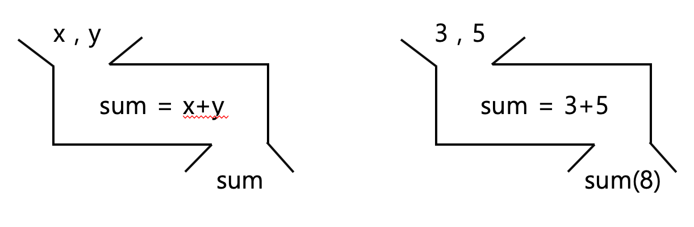

<!-- _class: title -->


# 데이터 과학을 위한 파이썬 프로그래밍

## 0. 함수와 클래스

---

# 학습 목표

- 함수와 클래스를 이해한다.
- 함수와 클래스를 정의하고 사용할 수 있다.

---

# 함수


---

# 함수



---

# 함수

<!-- _class: impact -->

함수는 입력을 받아서 출력을 내보내는 **블랙박스**

---

# 함수

- **함수의 이름**: 함수를 호출할 때 사용
- **매개변수**: 함수에 입력으로 전달되는 값
- **인자**: 함수를 호출할 때 전달되는 값
- **반환값**: 함수의 결과

---

# 함수 정의

```python
def 함수이름(매개변수):
    # 함수의 내용
    return 반환값
```

---

# 함수 정의

- `def` 키워드로 시작
- `:`으로 끝
- 들여쓰기로 함수의 내용을 구분

---

# 함수 정의

```python
def add(a, b):
    return a + b
```

- `add` 함수는 `a`와 `b`를 입력으로 받아서 `a + b`를 반환한다.

---

# 함수 호출

```python
add(1, 2)
```

- `add` 함수를 호출하면서 `1`과 `2`를 인자로 전달한다.
- `add` 함수는 `1 + 2`를 계산한 결과인 `3`을 반환한다.

---

# 함수 호출

```python
print(add(1, 2))
```

- `add` 함수의 반환값인 `3`을 `print` 함수의 인자로 전달한다.
- `print` 함수는 `3`을 출력한다.
- `print`도 **함수**!

---

# 함수 호출

```python
add(b=3, a=2)
```

- **키워드 인자**를 사용한 함수 호출
- `add` 함수를 호출하면서 `a=1`과 `b=2`를 인자로 전달한다.
- `add` 함수는 `1 + 2`를 계산한 결과인 `3`을 반환한다.

---

# 여러 가지 함수의 종류

- 입력이 없고, 출력도 없는 함수

  ```python
  def hello():
      print("Hello, world!")
  ```

- 입력이 있고, 출력이 없는 함수

  ```python
  def hello(name):
      print(f"Hello, {name}!")
  ```

---

# 여러 가지 함수의 종류

- 입력이 없고, 출력이 있는 함수

  ```python
  def pi():
      return 3.141592
  ```

- 입력이 있고, 출력도 있는 함수

  ```python
  def add(a, b):
      return a + b
  ```

---

# 함수 안에서 함수 호출하기

```python
def add(a, b):
    return a + b

def mul(a, b):
    return a * b

def add_mul(a, b):
    return mul(add(a, b), add(a, b))

add_mul(1, 2)   # 9
```

---

# 함수를 인자로 전달하기

```python
def add(a, b):
    return a + b

def mul(a, b):
    return a * b

def do(a, b, f):
    return f(a, b)

do(1, 2, add)   # 3
do(1, 2, mul)   # 2
```

---

# 익명 함수 (람다)

```python
def do(a, b, f):
    return f(a, b)

do(1, 2, lambda x, y: x + y)   # 3
do(1, 2, lambda x, y: x * y)   # 2
```

---

# 예제: 두 점 사이의 거리

---

# 예제: 자판기

---

# 클래스

```python
dog_name = "choco"
dog_age = 3

def whats_your_name(dog_name):
    print(f"My name is {dog_name}.")

def how_old_are_you(dog_age):
    print(f"I'm {dog_age} years old.")

def new_year(dog_age):
    return dog_age + 1
```

- `name`과 `age`를 합칠 수 있을까?

---

# 클래스

```python
dog = {"name": "choco", "age": 3}

def whats_your_name(dog):
    print(f"My name is {dog['name']}.")

def how_old_are_you(dog):
    print(f"I'm {dog['age']} years old.")

def new_year(dog):
    dog["age"] += 1
```

- 개가 여러 마리라면?

---

# 클래스

```python
dogs = [
    {"name": "choco", "age": 3},
    {"name": "merry", "age": 2},
    {"name": "ruby", "age": 4},
]

def whats_your_name(dog):
    print(f"My name is {dog['name']}.")

def how_old_are_you(dog):
    print(f"I'm {dog['age']} years old.")

def new_year(dog):
    dog["age"] += 1
```

---

# 클래스

<!-- _class: impact -->

연관있는 **변수**와 **함수**를 하나로 묶고 싶어!

---

# 클래스

```python
class Dog:
    def __init__(self, name, age):
        self.name = name
        self.age = age

    def whats_your_name(self):
        print(f"My name is {self.name}.")

    def how_old_are_you(self):
        print(f"I'm {self.age} years old.")

    def new_year(self):
        self.age += 1
```

---

# 클래스

```python
choco = Dog("choco", 3)
merry = Dog("merry", 2)
ruby = Dog("ruby", 4)

choco.whats_your_name()     # My name is choco.
merry.how_old_are_you()     # I'm 2 years old.
ruby.new_year()
ruby.how_old_are_you()      # I'm 5 years old.
```

---

# 클래스

- `class` 키워드로 시작
- `:`으로 끝
- 들여쓰기로 클래스의 내용을 구분

---

# 클래스

- `__init__` 메서드: **생성자**
- `self` 키워드: **인스턴스**를 가리키는 변수
- `choco`, `merry`, `ruby`: **인스턴스**
- `self.name`, `self.age`: **인스턴스 변수**
- `whats_your_name`, `how_old_are_you`, `new_year`: **인스턴스 메서드**

---

# 예제: 직사각형 클래스

---

# 예제: 자판기 클래스

---

# 실습: 간단한 콘솔 게임 만들기
