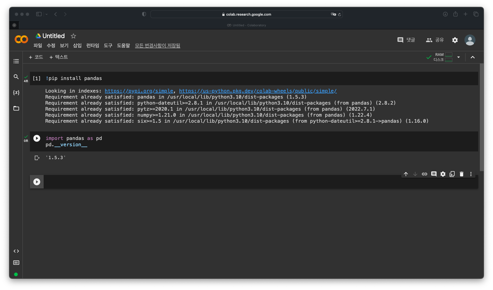

<!-- _class: title -->


# 데이터 과학을 위한 파이썬 프로그래밍

## 1. 판다스 사용법 익히기

---

# 학습 목표

- 주피터 노트북과 코랩을 사용하여 파이썬 코드를 실행할 수 있다
- 판다스를 사용하여 데이터를 다룰 수 있다

---

# 주피터 노트북 & 코랩 사용하기

- **주피터 노트북**: 웹 브라우저에서 파이썬 코드를 실행할 수 있는 환경
- **코랩**: 구글에서 제공하는 주피터 노트북 서비스
- 코랩에서 주피터 노트북을 실행하려면 구글 계정이 필요하므로,
  *구글 계정이 없는 경우 가입이 필요*합니다
- 코랩 접속: <https://colab.research.google.com>
- [새 노트] 버튼 클릭

---

# 주피터 노트북 & 코랩 사용하기



---

# 주피터 노트북 & 코랩 사용하기

- 주피터 노트북은 셀 단위로 코드를 실행할 수 있음
- 코랩에서는 코드를 입력하고 `Shift+Enter`를 누르면 실행됨
- 주피터 노트북에 아래 코드를 입력하고 실행해 보세요

  ```python
  a = int(input())
  if a > 0: print('양수')
  elif a < 0: print('음수')
  else: print('0')
  ```

---

# 판다스 설치 및 사용하기

- 판다스: 파이썬에서 데이터를 다루는 데 사용되는 라이브러리
- `pip install pandas` 명령으로 설치
- `import pandas as pd` 명령으로 사용
- 코랩에서는 이미 설치되어 있으므로 바로 사용 가능

```python
import pandas as pd
pd.__version__
```

```python
>>> '1.1.5'
```

---

# 판다스 데이터 구조

- 판다스에서는 데이터를 다루는 데 사용되는 여러 가지 데이터 구조를 제공
- **시리즈(Series)**: 1차원 배열
- **데이터프레임(DataFrame)**: 2차원 배열

---

# 시리즈(Series)

- 시리즈는 1차원 배열로, 인덱스(index)와 값(value)으로 구성됨
- 시리즈는 `pd.Series()` 함수를 사용하여 생성할 수 있음

```python
s = pd.Series(["apple", "banana", "carrot", "durian", "eggplant"])
s
```

---

# 데이터프레임(DataFrame)

- 데이터프레임은 2차원 배열로, 행(row)과 열(column)로 구성됨
- 데이터프레임은 `pd.DataFrame()` 함수를 사용하여 생성할 수 있음

```python
df = pd.DataFrame({
    "name": ["apple", "banana", "carrot", "durian", "eggplant"],
    "price": [1000, 2000, 3000, 4000, 5000]
})
df
```

---

# 데이터프레임(DataFrame)

<!-- _class: table-code -->

| name     | price |
| -------- | ----- |
| apple    | 1000  |
| banana   | 2000  |
| carrot   | 3000  |
| durian   | 4000  |
| eggplant | 5000  |

---

# 데이터프레임 인덱싱

- **인덱싱(indexing)**: 데이터프레임에서 특정 행이나 열을 선택하는 것

```python
df["name"]
df[["name", "price"]]
df[1:3]
```

---

# 데이터프레임 인덱싱

<!-- _class: table-code two-cols -->

| name     |
| -------- |
| apple    |
| banana   |
| carrot   |
| durian   |
| eggplant |

```python
df["name"]
```

---

# 데이터프레임 인덱싱

<!-- _class: table-code two-cols -->

| name     | price |
| -------- | ----- |
| apple    | 1000  |
| banana   | 2000  |
| carrot   | 3000  |
| durian   | 4000  |
| eggplant | 5000  |

```python
df[["name", "price"]]
```

---

# 데이터프레임 인덱싱

<!-- _class: table-code two-cols -->

| name   | price |
| ------ | ----- |
| banana | 2000  |
| carrot | 3000  |

```python
df[1:3]
```

---

# 데이터프레임 행 추가

<!-- _class: table-code two-cols -->

| name     | price |
| -------- | ----- |
| apple    | 1000  |
| banana   | 2000  |
| carrot   | 3000  |
| durian   | 4000  |
| eggplant | 5000  |
| fig      | 6000  |

```python
df.loc[5] = ["fig", 6000]
df
```

---

# 데이터프레임 열 추가

```python
df["color"] = ["red", "yellow", "orange", "green", "purple", "brown"]
df
```

---

# 데이터프레임 열 추가

<!-- _class: table-code -->

| name     | price | color  |
| -------- | ----- | ------ |
| apple    | 1000  | red    |
| banana   | 2000  | yellow |
| carrot   | 3000  | orange |
| durian   | 4000  | green  |
| eggplant | 5000  | purple |
| fig      | 6000  | brown  |

---

# 데이터프레임 행 수정

<!-- _class: table-code two-cols -->

| name     | price | color  |
| -------- | ----- | ------ |
| apple    | 1000  | red    |
| banana   | 2000  | yellow |
| carrot   | 3000  | orange |
| durian   | 4000  | green  |
| eggplant | 5000  | purple |
| fig      | 7000  | black  |

```python
df.loc[5] = ["fig", 7000, "black"]
df
```

---

# 데이터프레임 열 수정

<!-- _class: table-code two-cols -->

| name     | price | color  |
| -------- | ----- | ------ |
| apple    | 1000  | red    |
| banana   | 2000  | yellow |
| carrot   | 3000  | orange |
| durian   | 4000  | green  |
| eggplant | 5000  | purple |
| fig      | 6000  | black  |

```python
df["price"] = [1000, 2000, 3000, 4000, 5000, 6000]
df
```

---

# 데이터프레임 셀 수정

<!-- _class: table-code two-cols -->

| name     | price | color  |
| -------- | ----- | ------ |
| apple    | 1000  | red    |
| banana   | 2000  | yellow |
| carrot   | 3000  | orange |
| durian   | 4000  | green  |
| eggplant | 5000  | purple |
| fig      | 7000  | black  |

```python
df.loc[5, "price"] = 7000
df
```

---

# 데이터프레임 셀 수정

- `df[5]["price"] = 7000`은 안되나요?

  - df[]는 정수를 인덱스로 가질 수 없음

- `df.iloc`

  - 정수 인덱스를 사용하여 데이터프레임의 행이나 열을 선택할 수 있음

  ```python
  df.iloc[5, 1] = 7000
  ```

---

# 데이터프레임 행 삭제

<!-- _class: table-code two-cols -->

| name     | price | color  |
| -------- | ----- | ------ |
| apple    | 1000  | red    |
| banana   | 2000  | yellow |
| carrot   | 3000  | orange |
| durian   | 4000  | green  |
| eggplant | 5000  | purple |

```python
df.drop(5)
```

---

# 데이터프레임 열 삭제

<!-- _class: table-code two-cols -->

| name     | price |
| -------- | ----- |
| apple    | 1000  |
| banana   | 2000  |
| carrot   | 3000  |
| durian   | 4000  |
| eggplant | 5000  |

```python
df.drop("color", axis=1)
```

---

# 데이터프레임 정렬

- **정렬(sorting)**: 데이터프레임의 행이나 열을 특정 기준에 따라 재배열하는 것

```python
df.sort_values(by="price")
df.sort_values(by="price", ascending=False)
```

---

# 데이터 필터링

- `>`: 초과
- `<`: 미만
- `>=`: 이상
- `<=`: 이하
- `==`: 같음
- `!=`: 같지 않음

---

# 데이터 필터링

<!-- _class: table-code two-cols -->

| name     | price | color  |
| -------- | ----- | ------ |
| durian   | 4000  | green  |
| eggplant | 5000  | purple |

```python
df[df["price"] > 3000]
```

- `df["price"] > 3000`은 `price` 열의 값이 3000보다 큰지 여부를 나타냄
- `df[df["price"] > 3000]`은 `price` 열의 값이 3000보다 큰 행만 선택

---

# 데이터 필터링

<!-- _class: table-code two-cols -->

| name     | price | color  |
| -------- | ----- | ------ |
| apple    | 1000  | red    |
| banana   | 2000  | yellow |
| durian   | 4000  | green  |
| eggplant | 5000  | purple |

```python
df[df["color"] != "orange"]
```

---

# 데이터 필터링 (여러 조건)

- `&`: and
- `|`: or
- `~`: not

---

# 데이터 필터링 (여러 조건)

<!-- _class: table-code two-cols -->

| name     | price | color  |
| -------- | ----- | ------ |
| banana   | 2000  | yellow |
| durian   | 4000  | green  |
| eggplant | 5000  | purple |

```python
df[(df["price"] >= 2000) & (df["color"] != "orange")]
```

---

# 데이터 필터링 (값 대체)

<!-- _class: table-code two-cols -->

| name     | price | color  |
| -------- | ----- | ------ |
| apple    | 1000  | red    |
| banana   | 2000  | yellow |
| carrot   | 3000  | orange |
| durian   | 3000  | green  |
| eggplant | 3000  | purple |

```python
df.loc[df["price"] > 3000, "price"] = 3000
```

---

# 데이터 필터링 (값 대체)

- `df[df["price"] > 3000]["price"] = 3000`은 안되나요?
  - df[]가 복사본을 반환하기 때문
- df[] vs df.loc[]
  - df[]: 수정 불가능, 복사본 반환
  - df.loc[]: 수정 가능, 원본 반환

---

# 데이터 필터링 (값 대체)

- `replace()` 함수를 사용하여 값 대체 가능

```python
df["color"].replace("orange", "blue")
```

---

# 데이터프레임 병합

- **병합(merge)**: 두 개 이상의 데이터프레임을 하나로 합치는 것

```python
df1 = pd.DataFrame({
    "name": ["apple", "banana", "carrot", "durian", "eggplant"],
    "price": [1000, 2000, 3000, 4000, 5000]
})
df2 = pd.DataFrame({
    "name": ["apple", "banana", "carrot", "durian", "fig"],
    "color": ["red", "yellow", "orange", "green", "purple"]
})
```

---

# 데이터프레임 병합

<!-- _class: table-code two-cols -->

| name   | price | color  |
| ------ | ----- | ------ |
| apple  | 1000  | red    |
| banana | 2000  | yellow |
| carrot | 3000  | orange |
| durian | 4000  | green  |

```python
pd.merge(df1, df2)
```

---

# 데이터프레임 병합

<!-- _class: table-code two-cols -->

| name     | price | color  |
| -------- | ----- | ------ |
| apple    | 1000  | red    |
| banana   | 2000  | yellow |
| carrot   | 3000  | orange |
| durian   | 4000  | green  |
| eggplant | 5000  | NaN    |
| fig      | NaN   | purple |

```python
pd.merge(df1, df2, how="outer")
```

---

# 데이터프레임 병합

<!-- _class: table-code two-cols -->

| name     | price | color  |
| -------- | ----- | ------ |
| apple    | 1000  | red    |
| banana   | 2000  | yellow |
| carrot   | 3000  | orange |
| durian   | 4000  | green  |
| eggplant | 5000  | NaN    |

```python
pd.merge(df1, df2, how="left")
```

---

# 데이터프레임 병합

<!-- _class: table-code two-cols -->

| name   | price | color  |
| ------ | ----- | ------ |
| apple  | 1000  | red    |
| banana | 2000  | yellow |
| carrot | 3000  | orange |
| durian | 4000  | green  |
| fig    | NaN   | purple |

```python
pd.merge(df1, df2, how="right")
```
