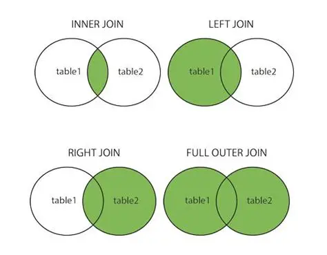
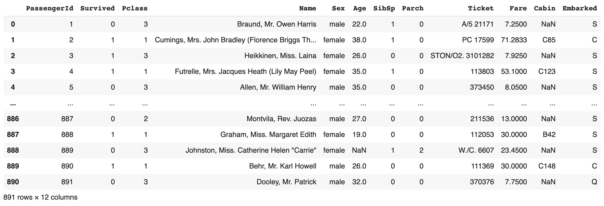
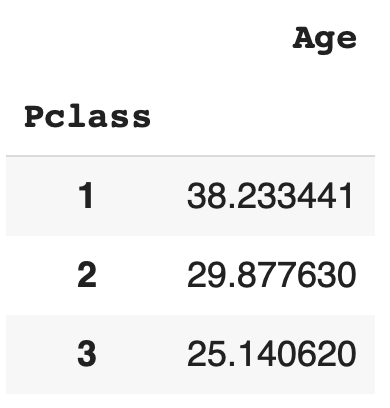
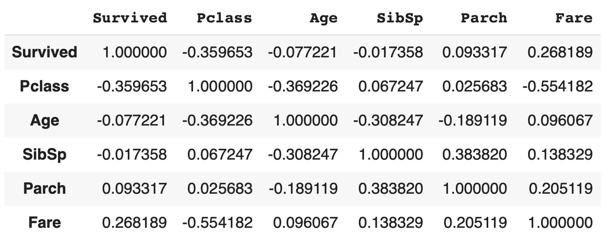

<!-- _class: title -->


# 데이터 과학을 위한 파이썬 프로그래밍

## 2. 판다스로 데이터 분석하기

---

# 학습 목표

- 판다스를 사용하여 데이터를 다룰 수 있다
- 여러 통계 기법을 이해할 수 있다
- 판다스를 사용하여 데이터를 분석할 수 있다

---

# 간단한 통계 수치

- **평균**: 데이터의 총합을 데이터의 개수로 나눈 값
- **중앙값**: 데이터를 크기 순서대로 정렬했을 때 가운데 위치한 값
- **최빈값**: 데이터에서 가장 많이 나타나는 값
- **표준편차**: 데이터가 평균으로부터 얼마나 떨어져 있는지를 나타내는 값
- **분산**: 표준편차의 제곱

---

# 간단한 통계 수치

- `mean()`: 평균
- `median()`: 중앙값
- `min()`: 최소값
- `max()`: 최대값
- `std()`: 표준편차
- `var()`: 분산
- `count()`: 개수
- `sum()`: 합계

---

# 간단한 통계 수치

```python
import pandas as pd

df = pd.DataFrame({
    "name": ["apple", "banana", "carrot", "durian", "eggplant"],
    "price": [1000, 2000, 3000, 4000, 5000],
    "size": [10, 20, 30, 40, 45]
})
```

---

# 간단한 통계 수치

<!-- _class: table-code -->

| name     | price | size |
| -------- | ----- | ---- |
| apple    | 1000  | 10   |
| banana   | 2000  | 20   |
| cherry   | 3000  | 30   |
| durian   | 4000  | 40   |
| eggplant | 5000  | 45   |

---

# 간단한 통계 수치

```python
df["price"].mean()    # 3000
df["price"].median()  # 3000
df["price"].min()     # 1000
df["price"].max()     # 5000
df["price"].std()     # 1581.1388300841897
df["price"].var()     # 2500000.0
df["price"].count()   # 5
df["price"].sum()     # 15000
```

---

# 간단한 통계 수치

<!-- _class: table-code table-small two-cols -->

|       | price      |
| ----- | ---------- |
| count | 5.0        |
| mean  | 3000.0     |
| std   | 1581.13883 |
| min   | 1000.0     |
| 25%   | 2000.0     |
| 50%   | 3000.0     |
| 75%   | 4000.0     |
| max   | 5000.0     |

```python
df["price"].describe()
```

---

# 복잡한 통계 수치

- **사분위수**: 데이터를 크기 순서대로 정렬했을 때 1/4, 2/4, 3/4 위치에 있는 값
- **백분위수**: 데이터를 크기 순서대로 정렬했을 때 1%, 2%, ..., 99% 위치에 있는 값
  - 25% 위치에 있는 값이 1사분위수
  - 50% 위치에 있는 값이 중앙값(2사분위수)
  - 75% 위치에 있는 값이 3사분위수

---

# 복잡한 통계 수치

- **상관계수**: 두 변수가 얼마나 관련이 있는지를 나타내는 값
  - $-1 \le r_{XY} \le 1$
  - $r_{XY} = 1$이면 완전한 양의 상관관계
  - $r_{XY} = -1$이면 완전한 음의 상관관계
  - $r_{XY} = 0$이면 상관관계 없음

---

# 복잡한 통계 수치

- `quantile(q)`: q-분위수
- `corr()`: 상관계수

---

# 복잡한 통계 수치

```python
df["price"].quantile(0.25)    # 2000.0
df["price"].quantile(0.5)     # 3000.0
df["price"].quantile(0.75)    # 4000.0
df["price"].corr(df["size"])  # 0.9970544855015815
```

---

# 데이터 그룹화

- 데이터를 특정 기준에 따라 여러 그룹으로 나누는 것
- `groupby()`: 데이터를 그룹화
- `agg()`: 그룹화된 데이터에 대해 통계 수치를 계산

---

# 데이터 그룹화

```python
df["category"] = ["fruit", "fruit", "vegetable", "fruit", "vegetable"]
```

<!-- _class: table-code -->

| name     | price | size | category  |
| -------- | ----- | ---- | --------- |
| apple    | 1000  | 10   | fruit     |
| banana   | 2000  | 20   | fruit     |
| cherry   | 3000  | 30   | vegetable |
| durian   | 4000  | 40   | fruit     |
| eggplant | 5000  | 45   | vegetable |

---

# 데이터 그룹화

<!-- _class: table-code -->

```python
df.groupby("category").mean()
```

| category  | price  | size       |
| --------- | ------ | ---------- |
| fruit     | 2500.0 | 23.3333333 |
| vegetable | 4000.0 | 37.5       |

---

# 데이터 그룹화

<!-- _class: table-code -->

```python
df.groupby("category").count()
```

| category  | name | price | size |
| --------- | ---- | ----- | ---- |
| fruit     | 3    | 3     | 3    |
| vegetable | 2    | 2     | 2    |

---

# 데이터 그룹화

<!-- _class: table-code table-two-heads -->

```python
df.groupby("category").agg(["mean", "median", "std"])
```

| category  | price                  | size                   |
| --------- | ---------------------- | ---------------------- |
|           | mean median std        | mean  median std       |
| fruit     | 2500 2500   1299.03811 | 23.33 23.33  15.275252 |
| vegetable | 4000 4000   1414.21356 | 37.5  37.5   10.606602 |

---

# 데이터 그룹화

<!-- _class: table-code table-two-heads -->

```python
df.groupby("category").agg({
    "price": ["mean", "median"],
    "size": "std",
})
```

| category  | price       | size      |
| --------- | ----------- | --------- |
|           | mean median | std       |
| fruit     | 2500 2500   | 15.275252 |
| vegetable | 4000 4000   | 10.606602 |

---

# 데이터프레임 병합

- **병합(merge)**: 두 개 이상의 데이터프레임을 하나로 합치는 것

```python
df1 = pd.DataFrame({
    "name": ["apple", "banana", "carrot", "durian", "eggplant"],
    "price": [1000, 2000, 3000, 4000, 5000]
})
df2 = pd.DataFrame({
    "name": ["apple", "banana", "carrot", "durian", "fig"],
    "color": ["red", "yellow", "orange", "green", "purple"]
})
```

---

# 데이터프레임 병합

<!-- _class: table-code two-cols -->

| name   | price | color  |
| ------ | ----- | ------ |
| apple  | 1000  | red    |
| banana | 2000  | yellow |
| carrot | 3000  | orange |
| durian | 4000  | green  |

```python
pd.merge(df1, df2)
```

---

# 데이터프레임 병합

<!-- _class: table-code two-cols -->

| name     | price | color  |
| -------- | ----- | ------ |
| apple    | 1000  | red    |
| banana   | 2000  | yellow |
| carrot   | 3000  | orange |
| durian   | 4000  | green  |
| eggplant | 5000  | NaN    |
| fig      | NaN   | purple |

```python
pd.merge(df1, df2, how="outer")
```

---

# 데이터프레임 병합

<!-- _class: table-code two-cols -->

| name     | price | color  |
| -------- | ----- | ------ |
| apple    | 1000  | red    |
| banana   | 2000  | yellow |
| carrot   | 3000  | orange |
| durian   | 4000  | green  |
| eggplant | 5000  | NaN    |

```python
pd.merge(df1, df2, how="left")
```

---

# 데이터프레임 병합

<!-- _class: table-code two-cols -->

| name   | price | color  |
| ------ | ----- | ------ |
| apple  | 1000  | red    |
| banana | 2000  | yellow |
| carrot | 3000  | orange |
| durian | 4000  | green  |
| fig    | NaN   | purple |

```python
pd.merge(df1, df2, how="right")
```

---

# 데이터프레임 병합



---

# 피벗 테이블

- 데이터를 특정 기준에 따라 여러 그룹으로 나누는 것
- `pivot_table()`: 데이터를 그룹화
- `aggfunc`: 그룹화된 데이터에 대해 통계 수치를 계산

---

# 피벗 테이블

<!-- _class: table-code table-two-heads -->

```python
df.pivot_table(
    index="category",
    values=["price", "size"],
    aggfunc=["mean", "sum"],
)
```

| category  | mean         | sum        |
| --------- | ------------ | ---------- |
|           | price size   | price size |
| fruit     | 2500  23.33  | 7500  70   |
| vegetable | 4000  37.5   | 8000  75   |

---

# 피벗 테이블

```python
df["favorite"] = [3, 2, 1, 2, 3]
```

<!-- _class: table-code -->

| name     | price | size | category  | favorite |
| -------- | ----- | ---- | --------- | -------- |
| apple    | 1000  | 10   | fruit     | 3        |
| banana   | 2000  | 20   | fruit     | 2        |
| cherry   | 3000  | 30   | vegetable | 1        |
| durian   | 4000  | 40   | fruit     | 2        |
| eggplant | 5000  | 45   | vegetable | 3        |

---

# 피벗 테이블

<!-- _class: table-code table-two-heads -->

```python
df.pivot_table(
    index="category",
    columns="favorite",
    values=["price", "size"],
    aggfunc=["mean"],
)
```

```text
             mean
            price                    size
favorite        1       2       3       1       2       3
category
fruit         NaN  3000.0  1000.0     NaN    30.0     10.0
vegetable  3000.0     NaN  5000.0    30.0     NaN     45.0
```

---

# 교차표

- 두 개의 범주형 변수에 대해 빈도를 계산한 표
- `crosstab()`: 교차표를 생성

---

# 교차표

```python
pd.crosstab(df["category"], df["favorite"])
```

<!-- _class: table-code table-two-heads -->

| favorite  | 1   | 2   | 3   |
| --------- | --- | --- | --- |
| category  |     |     |     |
| fruit     | 0   | 2   | 1   |
| vegetable | 1   | 0   | 1   |

- 위 결과에서 얻을 수 있는 정보는?

---

# 실습: 타이타닉 데이터 분석

- 데이터셋 다운로드
  https://www.kaggle.com/competitions/titanic/data?select=train.csv
  에서 `train.csv` 파일 다운로드하기

---

# 실습: 타이타닉 데이터 분석

- `train.csv` 파일 불러오기

  - ```python
    df = pd.read_csv("train.csv")
    ```



---

# 실습: 타이타닉 데이터 분석

- `NaN` 값이 있는 행 제거하기

- `Pclass` 열로 그룹화한 뒤 각각의 `Age` 속성값의 평균을 계산해보기



---

# 실습: 타이타닉 데이터 분석

- `Survived`에 대한 `Pclass`, `Age`, `SibSp` 열의 상관계수를 구하여 연관관계 도출해보기

---

# 실습: 타이타닉 데이터 분석

- 숫자 데이터로 이루어진 열들(`Survived`, `Pclass`, `Age`, `SibSp`, `Parch`, `Fare`)만 남긴 후, `Survived`에 대한 각 열의 상관계수를 구하여 연관관계 도출해보기

  - 참고: `df.corr()` 함수 사용!


