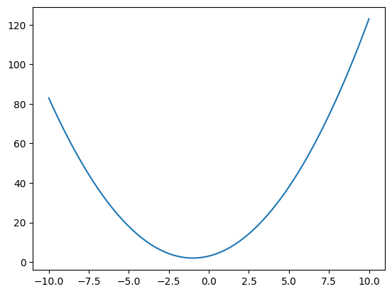
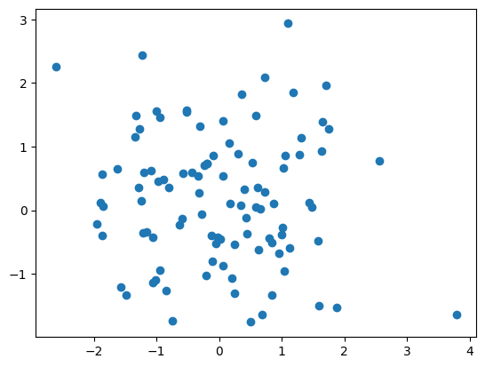
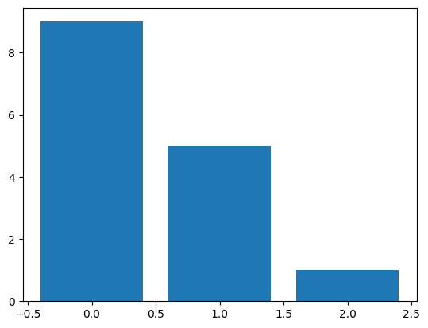
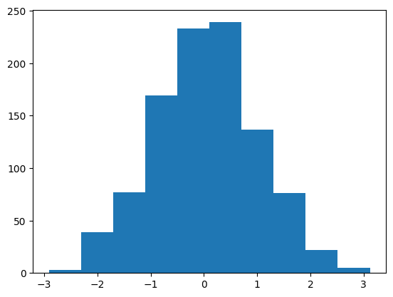
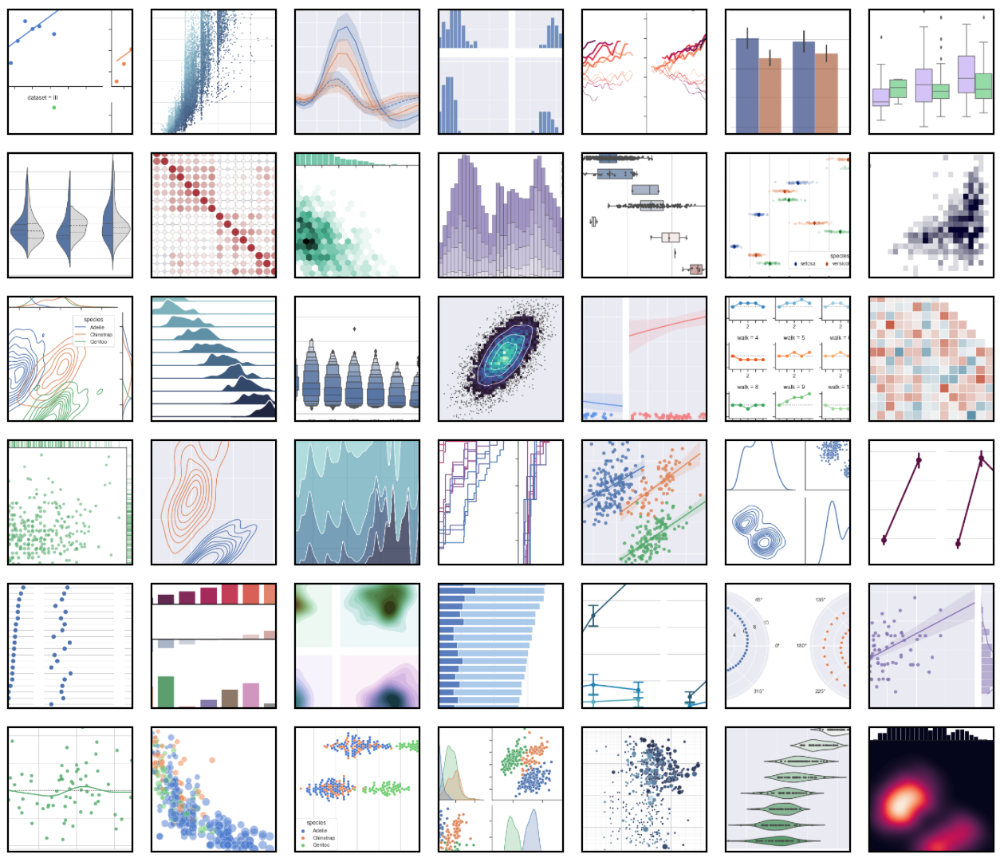
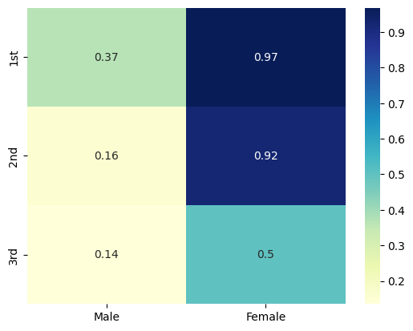

<!-- _class: title -->


# 데이터 과학을 위한 파이썬 프로그래밍

## 3. 데이터 시각화

---

# 학습 목표

- `numpy`를 사용하여 데이터를 다룰 수 있다.
- `matplotlib`를 사용하여 데이터를 시각화할 수 있다.
- `seaborn`을 사용하여 데이터를 시각화할 수 있다.

---

# numpy

- `numpy`는 파이썬에서 수치 계산을 위한 패키지
- `numpy`의 핵심은 다차원 배열
- `numpy`의 배열은 모두 같은 타입의 데이터만 저장할 수 있음
- `numpy`의 배열은 파이썬의 리스트와 유사하지만, 다음과 같은 장점이 있음
  - 빠른 속도
  - 메모리 효율성
  - 편리한 인덱싱

---

# numpy 배열 생성

- `numpy` 배열은 `np.array` 함수를 사용하여 생성
- 파이썬의 리스트를 인자로 전달하여 생성

  ```python
  import numpy as np

  a = np.array([1, 2, 3])
  print(a)  # [1 2 3]
  ```

---

# numpy 배열의 속성

- numpy 배열의 타입은 `numpy.ndarray`임

  ```python
    print(type(a))  # <class 'numpy.ndarray'>
  ```

- numpy 배열의 타입은 `dtype` 속성으로 확인 가능

  ```python
  print(a.dtype)    # int64
  ```

- numpy 배열의 차원은 `ndim` 속성으로 확인 가능

  ```python
  print(a.ndim)     # 1
  ```

---

# numpy 배열의 속성

- numpy 배열의 크기는 `shape` 속성으로 확인 가능

  ```python
  print(a.shape)    # (3,)
  ```

- numpy 배열의 크기는 `size` 속성으로 확인 가능

  ```python
  print(a.size)     # 3
  ```

---

# numpy 배열의 타입

- `np.int8`, `np.int16`, `np.int32`, `np.int64`
- `np.uint8`, `np.uint16`, `np.uint32`, `np.uint64`
- `np.float16`, `np.float32`, `np.float64`, `np.float128`
- `np.complex64`, `np.complex128`, `np.complex256`
- `np.bool`

---

# linspace 함수

- `np.linspace` 함수는 세 개의 인자를 받음
  - 시작값
  - 끝값
  - 생성할 데이터의 개수
- 시작값과 끝값 사이에 지정한 개수만큼의 데이터를 생성

  ```python
  x = np.linspace(0, 10, 5)
  print(x)  # [ 0.   2.5  5.   7.5 10. ]
  ```

---

# 데이터 시각화

- **데이터 시각화**: 데이터를 그래프나 도표로 표현하는 것
- 데이터 시각화의 장점
  - 데이터의 특징을 파악하기 쉬움
  - 데이터의 특징을 쉽게 설명할 수 있음
  - 데이터의 특징을 쉽게 전달할 수 있음
- **도표**: 여러 가지 자료를 분석하여 그 관계를 일정한 양식의 그림으로 나타낸 표
- **그래프**: 여러 가지 자료를 분석하여 그 변화를 한눈에 알아볼 수 있도록 나타내는 직선이나 곡선

---

# 데이터 시각화

예시: COVID-19 글로벌 진행 상황


---

# 데이터 시각화

예시: UN의 지속가능한 발전 목표 분석


---

# matplotlib

- 파이썬에서 가장 널리 사용되는 데이터 시각화 라이브러리
- `matplotlib`의 서브패키지
  - `pyplot`: `matplotlib`의 핵심 모듈
  - `pylab`: `pyplot`과 `numpy`를 함께 사용할 수 있도록 하는 모듈
- `pyplot`을 사용하기 위해서는 다음과 같이 임포트

  ```python
  import matplotlib.pyplot as plt
  ```

---

# 예제: 이차함수 그래프

이차함수 $y = ax^2 + bx + c$의 그래프를 그려보자.

```python
import matplotlib.pyplot as plt     # matplotlib의 서브패키지 pyplot 임포트

def f(x, a, b, c):                  # 이차함수 정의
    return a * x ** 2 + b * x + c   # 이차함수의 값 계산

x = np.linspace(-10, 10, 100)       # x 좌표 생성
y = f(x, 1, 2, 3)                   # y 좌표 생성

plt.plot(x, y)                      # 그래프 그리기
plt.show()                          # 그래프 출력
```

---

# 예제: 이차함수 그래프



---

# 예제: 이차함수 그래프 (추가)

다음과 같이 함수를 작성할 수도 있음

```python
import matplotlib.pyplot as plt

def make_quad(a, b, c):
    def f(x): return a * x ** 2 + b * x + c
    return f

f = make_quad(a=1, b=2, c=3)
x = np.linspace(-10, 10, 100)

plt.plot(x, f(x))
plt.show()
```

---

# 도표의 종류

- 선 그래프
- 산점도
- 막대 그래프
- 히스토그램
- 파이 그래프
- ...

---

# 선 그래프

<!-- _class: two-cols -->


```python
import matplotlib.pyplot as plt

x = np.linspace(-10, 10, 100)
y = np.abs(x)   # x의 절댓값

plt.plot(x, y)
plt.show()
```

---

# 산점도

<!-- _class: two-cols -->



```python
import matplotlib.pyplot as plt

# np.random.randn: 평균 0, 표준편차 1인
# 정규분포에서 100개의 난수 생성
x = np.random.randn(100)    # x 좌표
y = np.random.randn(100)    # y 좌표

plt.scatter(x, y)
plt.show()
```

---

# 막대 그래프

<!-- _class: two-cols -->



```python
import matplotlib.pyplot as plt

x = np.arange(3)    # [0, 1, 2]

# 1부터 9까지의 정수 중에서 3개의 난수 생성
y = np.random.randint(1, 10, 3) # [9, 5, 1]

plt.bar(x, y)
plt.show()
```

---

# 히스토그램

<!-- _class: two-cols -->



```python
import matplotlib.pyplot as plt

# 평균 0, 표준편차 1인 정규분포에서
# 1000개의 난수 생성
x = np.random.randn(1000)

plt.hist(x)
plt.show()
```

---

# 파이 그래프

<!-- _class: two-cols -->


```python
import matplotlib.pyplot as plt

x = np.random.randint(1, 10, 3) # [5, 8, 7]

plt.pie(x)
plt.show()
```

---

# seaborn

- `seaborn`은 `matplotlib`을 기반으로 만들어진 파이썬 데이터 시각화 라이브러리
- `seaborn`의 장점
  - `matplotlib`보다 간단한 코드로 동일한 그래프를 그릴 수 있음
  - `matplotlib`보다 더 예쁜 그래프를 그릴 수 있음
  - `matplotlib`보다 더 다양한 그래프를 그릴 수 있음
- `seaborn`을 사용하기 위해서는 다음과 같이 임포트

  ```python
  import seaborn as sns
  ```

---

# seaborn으로 그릴 수 있는 도표



---

# seaborn으로 그릴 수 있는 도표

[seaborn gallery](https://seaborn.pydata.org/examples/index.html)

---

# 실습: 타이타닉 데이터 분석

[Dataset](https://github.com/doldam0/dypython/blob/main/lectures/ch02/data/train.csv)

---

# 실습: 타이타닉 데이터 분석

```python
import pandas as pd
import seaborn as sns

df = pd.read_csv('train.csv')

df.loc[df["Sex"] == "male", "Sex"] = 0
df.loc[df["Sex"] == "female", "Sex"] = 1
df.loc[df["Embarked"] == "S", "Embarked"] = 0
df.loc[df["Embarked"] == "C", "Embarked"] = 1
df.loc[df["Embarked"] == "Q", "Embarked"] = 2
df = df.drop("PassengerId", axis=1)

sns.pairplot(df, hue="Survived")
```

---

# 실습: 타이타닉 데이터 분석


---

# 실습: 타이타닉 데이터 분석

위 데이터 분석으로 알 수 있는 것은?

---

# 실습: 타이타닉 데이터 분석

3등석에 탑승한 남자 승객의 생존률은?

```python
total = df[df["Pclass"] == 3 & df["Sex"] == 0]
survived = total[total["Survived"] == 1]

# 3등석에 탑승한 남자 승객의 생존률
print(len(survived) / len(total)) # 0.13544668587896252

# 전체 생존률
print(df["Survived"].mean())      # 0.3838383838383838
```

⇒ 객석의 등급과 성별이 생존률에 영향을 미침

---

# 실습: 타이타닉 데이터 분석

```python
df["Sex"] = df["Sex"].astype("int64")     # 파이썬 타입을 numpy 타입으로 변환
print(df["Survived"].corr(df["Sex"]))     # 0.5433513806577552
print(df["Survived"].corr(df["Pclass"]))  # -0.33848103596101536
```

⇒ 성별과 생존률, 객실 등급과 생존률은 서로 상관관계를 가짐

---

# 실습: 타이타닉 데이터 분석

<!-- _class: two-cols -->


```python
sns.countplot(x="Pclass", hue="Survived", data=df)
```

---

# 실습: 타이타닉 데이터 분석

<!-- _class: two-cols -->


```python
sns.countplot(x="Sex", hue="Survived", data=df)
```

---

# 실습: 타이타닉 데이터 분석

```python
# Confusion Matrix
m = []
for p_class in (1, 2, 3):
    m_item = []
    for sex in (0, 1):
        total = df[(df["Pclass"] == p_class) & (df["Sex"] == sex)]
        survived = total[total["Survived"] == 1]
        m_item.append(len(survived) / len(total))
    m.append(m_item)

print(m)
```

---

# 실습: 타이타닉 데이터 분석

<!-- _class: two-cols -->



```python
sns.heatmap(m, annot=True, cmap="YlGnBu",
            xticklabels=("Male", "Female"),
            yticklabels=("1st", "2nd", "3rd"))
```

---

# 실습: 타이타닉 데이터 분석

- 결론
  - 여성 승객의 생존률이 남성 승객의 생존률보다 높음
  - 1등석 승객의 생존률이 2등석 승객의 생존률보다 높음
  - 2등석 승객의 생존률이 3등석 승객의 생존률보다 높음
- 추가 분석
  - 나이와 생존률의 상관관계
  - 선착장과 생존률의 상관관계
  - 가족과 생존률의 상관관계
